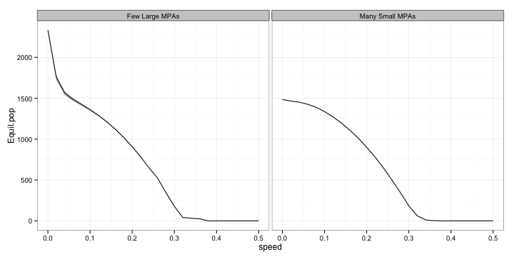
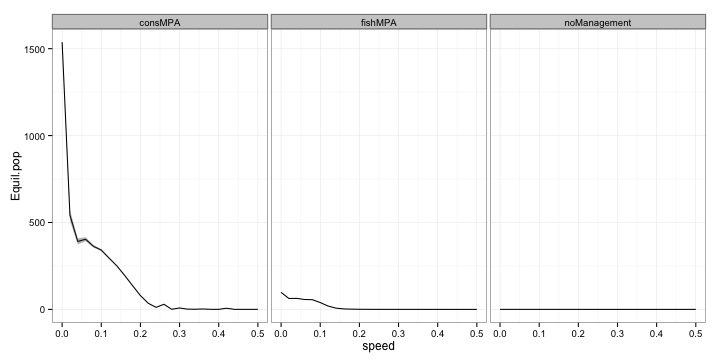
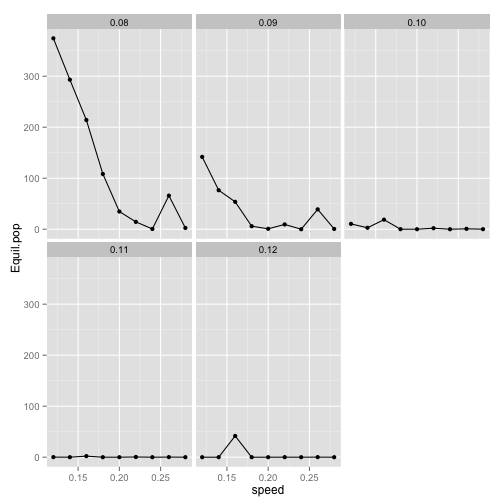
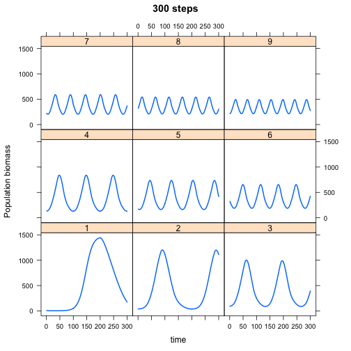
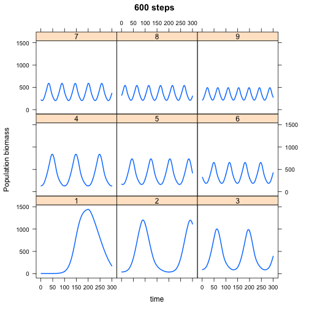
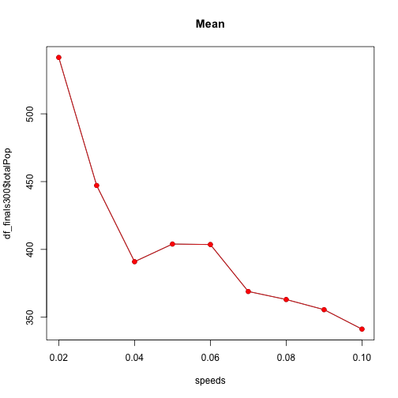

# Effect of MPAs


Have noticed that there's a section of parameter space in which the `Equil.pop` varies in the `consMPA` simulations. Why is that?


Map equilibrium harvest as function of speed of climate velocity and harvest rate.

 


Looks like conservation MPAs do the best, but there are some weird fluctuations at higher harvest rates, why is that? Can take slices to look more closely

 


Trying the same plot but a higher rate of catch: $h = 0.10$ I get,

 


The relevant section of parameter space is shown below

 


The next step is to run a few of these simulations and save entire outputs (biomass over space/time). Will do $h = 0.10, s = 0.02-0.07$ 


After re-running the model, can see that it replicates the pattern of fluctuating total biomas
 

And when you look at the time-series population trends, it's as we expected. All the populations have the same pattern, that they oscillate up and down depending on whether or not they're in a reserve, but the slowest speeds go through the biggest oscillations which means that the average population is much lower. However I wonder if just extending the number of time steps over which I run the average would reduce this effect. 
 

After re-running the simulation (this time with 600 time steps for equilibrium)


  


This seems to matter a little bit

 


This is weird, shouldn't be like this, not sure why it is. Needs more work. Next step is to try 900 steps to see if the equilibrium varies


```
## [1] 301
```

```
## [1] 301
```

```
## [1] 301
```

```
## [1] 302
```

```
## [1] 303
```

```
## [1] 301
```

```
## [1] 302
```

```
## [1] 303
```

```
## [1] 304
```

```
## [1] 305
```

```
## [1] 306
```

```
## [1] 307
```

```
## [1] 308
```

```
## [1] 309
```

```
## [1] 310
```

```
## [1] 311
```

```
## [1] 312
```

```
## [1] 313
```

```
## [1] 314
```

```
## [1] 315
```

```
## [1] 316
```

```
## [1] 317
```

```
## [1] 318
```

```
## [1] 319
```

```
## [1] 320
```

```
## [1] 321
```

```
## [1] 322
```

```
## [1] 301
```

```
## [1] 301
```


  

