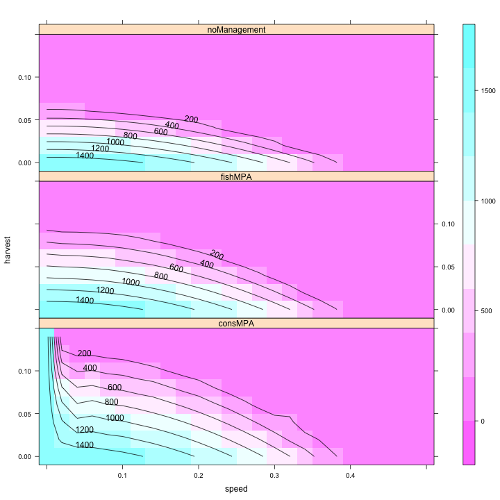

# Effect of MPAs

Have noticed that there's a section of parameter space in which the `Equil.pop` varies in the `consMPA` simulations. Why is that?

Map equilibrium harvest as function of speed of climate velocity and harvest rate.

 

Looks like conservation MPAs do the best, but there are some weird fluctuations at higher harvest rates, why is that? Can take slices to look more closely

 

Trying the same plot but a higher rate of catch: $h = 0.10$ I get,

 

The relevant section of parameter space is shown below

 

