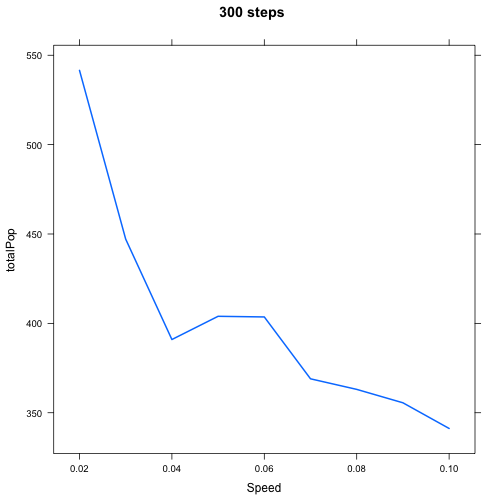
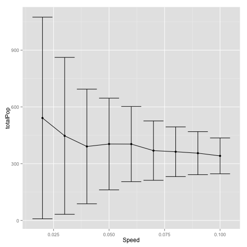

# Effect of MPAs


Have noticed that there's a section of parameter space in which the `Equil.pop` varies in the `consMPA` simulations. Why is that?


```
## Warning: EOF within quoted string
```

```
## Error: duplicate 'row.names' are not allowed
```

```
## Warning: EOF within quoted string
```

```
## Error: duplicate 'row.names' are not allowed
```

```
## Warning: EOF within quoted string
```

```
## Error: duplicate 'row.names' are not allowed
```

```
## Error: object 'sim' not found
```

```
## Error: object 'consmpa' not found
```

```
## Error: object 'fishmpa' not found
```

```
## Error: object 'sim' not found
```

Map equilibrium harvest as function of speed of climate velocity and harvest rate.


```
## Error: object 'allData' not found
```


Looks like conservation MPAs do the best, but there are some weird fluctuations at higher harvest rates, why is that? Can take slices to look more closely


```
## Error: object 'allData' not found
```

```
## Error: object 'subData' not found
```


Trying the same plot but a higher rate of catch: $h = 0.10$ I get,


```
## Error: object 'allData' not found
```

```
## Error: object 'subData' not found
```


The relevant section of parameter space is shown below


```
## Error: object 'allData' not found
```

```
## Error: object 'subData' not found
```


The next step is to run a few of these simulations and save entire outputs (biomass over space/time). Will do $h = 0.10, s = 0.02-0.07$ 


After re-running the model, can see that it replicates the pattern of fluctuating total biomas
  

And when you look at the time-series population trends, it's as we expected. All the populations have the same pattern, that they oscillate up and down depending on whether or not they're in a reserve, but the slowest speeds go through the biggest oscillations which means that the average population is much lower. However I wonder if just extending the number of time steps over which I run the average would reduce this effect. 
 

After re-running the simulation (this time with 600 time steps for equilibrium)

```
## Warning: cannot open file 'Figures/variable_steps.R': No such file or
## directory
```

```
## Error: cannot open the connection
```


  


This seems to matter a little bit

 


This is weird, shouldn't be like this, not sure why it is. Needs more work. Next step is to try 900 steps to see if the equilibrium varies


```
## Warning: cannot open file 'Figures/variable_steps.R': No such file or
## directory
```

```
## Error: cannot open the connection
```


```
## Warning: cannot open file 'Figures/variable_steps.R': No such file or
## directory
```

```
## Error: cannot open the connection
```


```
## Warning: cannot open file 'Figures/variable_steps.R': No such file or
## directory
```

```
## Error: cannot open the connection
```


```
## Warning: cannot open file 'Figures/variable_steps.R': No such file or
## directory
```

```
## Error: cannot open the connection
```

```
## Loading required package: RColorBrewer
```
