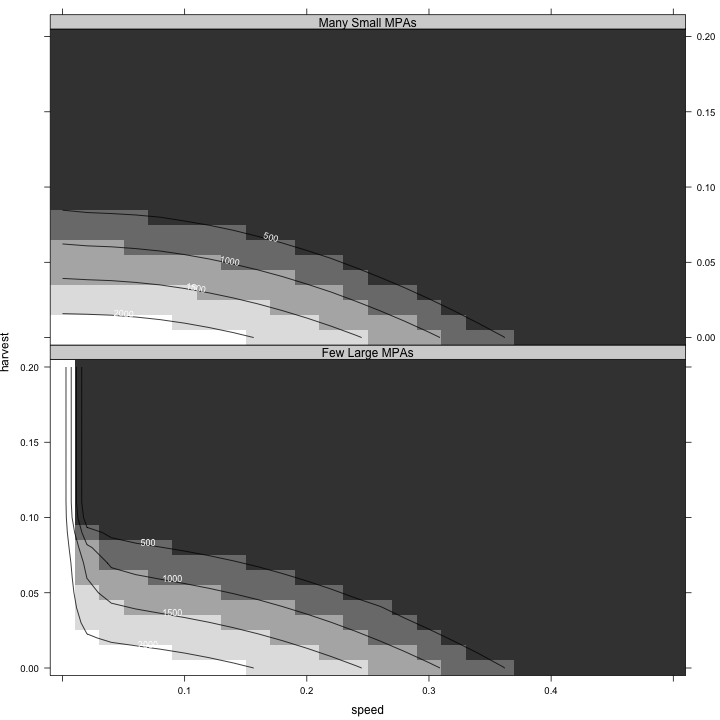
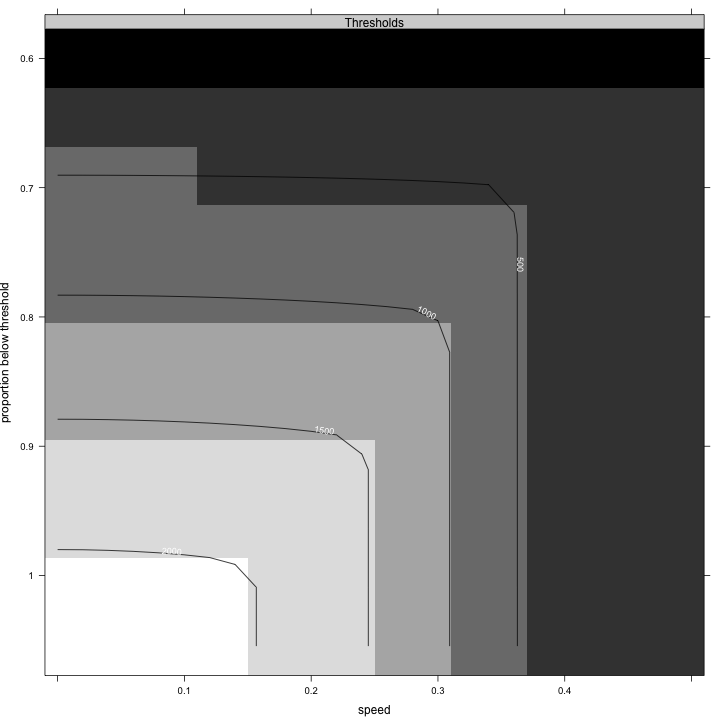
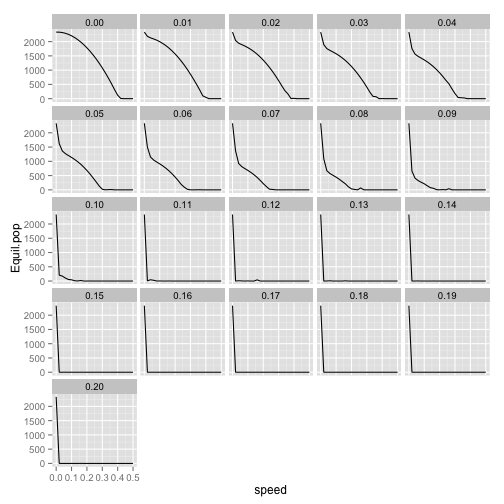

# Figuring out the weird contour plot for `consmpa`

# Effect of MPAs


Have noticed that there's a section of parameter space in which the `Equil.pop` varies in the `consMPA` simulations. Why is that?


Map equilibrium harvest as function of speed of climate velocity and harvest rate.

  


Looking at the weird variance in some of the `consmpa` simulations, try to target


```r
ggplot(consmpa, aes(x = speed, y = Equil.pop)) + geom_line() + facet_wrap(~harvest)
```

 


Looks like it's in `h=0.08,0.09, 0.1, 0.12`


The relevant section of parameter space is shown below

 

And it's in different places depending on the harvest.. So the simulations to look at are 

+ `h = 0.08; s = 0.24-0.28`
+ `h = 0.09; s = 0.24-0.28`
+ `h = 0.10; s = 0.14-0.16`
+ `h = 0.12; s = 0.14-0.16`
