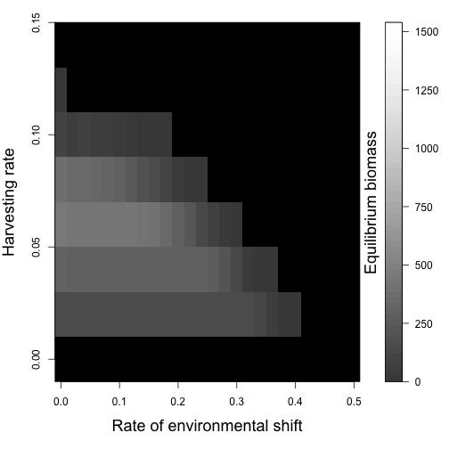
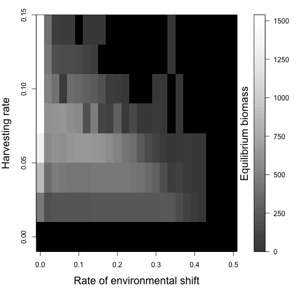

# Comparing MPAs to each other, to no management

Comparing no management to several small MPAs

 

Comparing no management to few large MPAs

 

Comparing the MPAs to each other (cons - fish)

 

