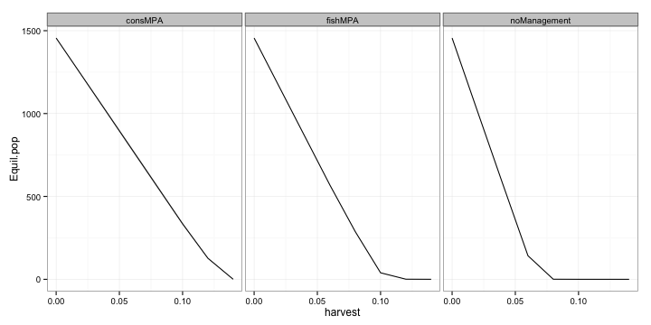

# Comparing catch

Map equilibrium harvest as function of speed of climate velocity and harvest rate.

 

Looks like conservation MPAs do the best, but there are some weird fluctuations at higher harvest rates, why is that? Can take slices to look more closely

 

Trying the same plot but a higher rate of catch: $h = 0.10$ I get,

 

Looking at holding speed constant and examining population as a function of harvest rate

   

Need to redo simulations and examine what's going on. Just looking at initialized conservation MPA simulation, see that the whole right side of the MPA has declined due to harvest on the outside. 

 

Almost certainly the issue is that for each run of the simulation, the MPA borders are not starting at the same location. So how the population does at the beginning will vary. That's the first thing that needs to be fixed. 

It looks like the `MPA.current` variable is not being re-set and is just picking up where it left off for the previous run of the simulation. 

