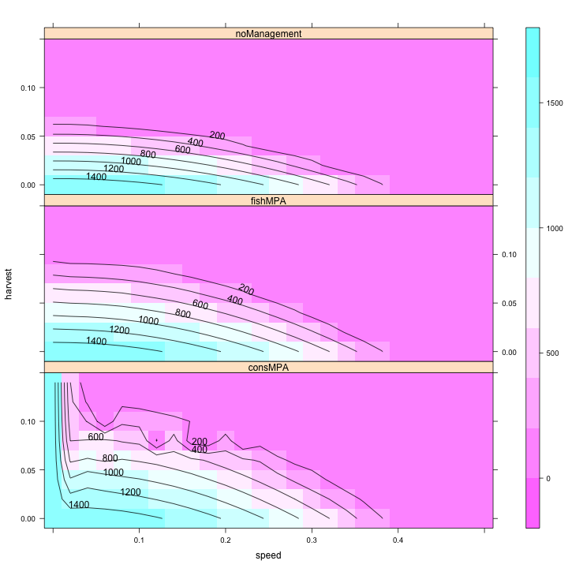
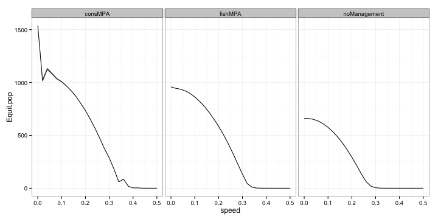
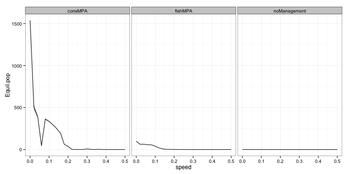
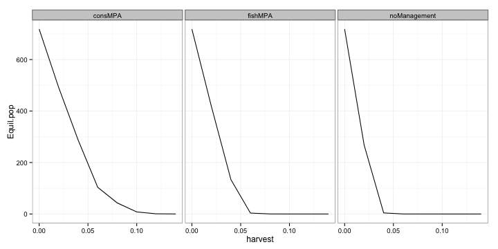

# Comparing catch

Map equilibrium harvest as function of speed of climate velocity and harvest rate.

 

Looks like conservation MPAs do the best at the highest amount of harvest rates. Wonder if there's a difference in variance among these different MPAs. Subsetting the data to just look at harvest rate = 0.04 I find that the conservation MPA seems to have the most variance around average catch. 

 

Trying the same plot but a higher rate of catch: $$h = 0.10$$ I get,

 

Looking at holding speed constant and examining catch as a function of harvest

   

